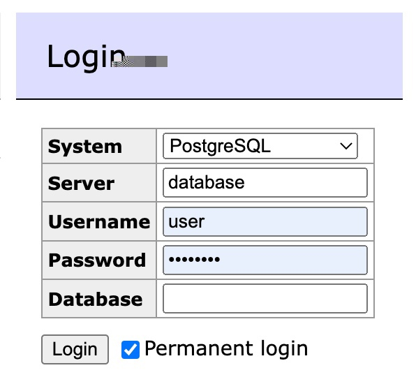

# Colibri

## Installation

For local installation this project you need docker and node.js. Next, clone repository and run:

```bash
# Install dependencies
yarn install
# Launch postgress and admin panel for database
docker-compose up -d
# Prepare database for using. Creates tables, users, etc
yarn api:prepare
# Launch api in dev mode
yarn api:start
```

It's all of you need. When docker is running, you can visit http://localhost:8080. There will be
admin panel for your database. Default credentials:



If you want to stop database, run:

```bash
# Stop database and adminer
docker-compose down
```
